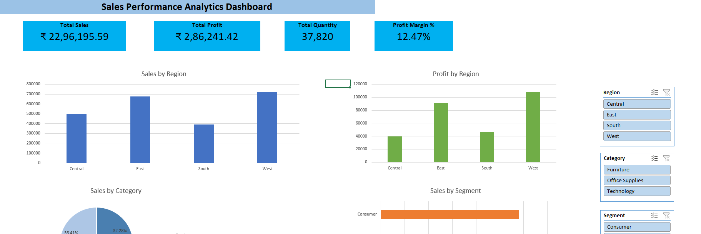
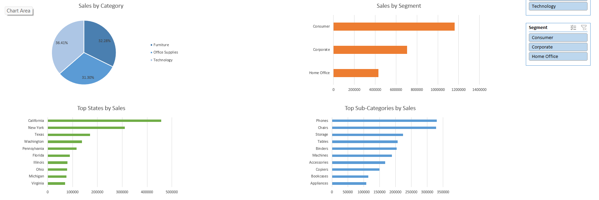

# Sales Performance Analytics Dashboard

## Project Overview

This project analyzes retail sales data using Python, SQL, and Excel. The dataset was cleaned and transformed using Python (Pandas), analyzed using SQL queries, and visualized through an interactive Excel dashboard.

The dashboard helps track key business metrics such as sales, profit, quantity sold, profit margin, regional performance, category performance, customer segments, and top-performing products. The goal of the project is to generate business insights and support data-driven decision-making.

## Tools & Technologies

- Python (Pandas)
- SQL (MySQL)
- Microsoft Excel
- Pivot Tables
- Pivot Charts
- Slicers

## Key KPIs

- Total Sales: INR 22,96,195.59
- Total Profit: INR 2,86,241.42
- Total Quantity Sold: 37,820
- Profit Margin: 12.47%

## Key Insights

- West region generated the highest sales and profit.
- Technology category was the most profitable.
- Consumer segment contributed the highest sales.
- Phones and Chairs were the top-performing sub-categories.
- Overall profit margin was 12.47%.

## Dashboard Preview

### Dashboard - Part 1

### Dashboard - Part 2

## Project Workflow

1. Data Cleaning using Python (Pandas)
2. Business Analysis using SQL
3. Dashboard Development using Excel
4. KPI Tracking and Insight Generation

## Skills Demonstrated

- Data Cleaning
- Data Analysis
- SQL Queries
- Data Visualization
- Excel Dashboarding
- KPI Development
- Business Intelligence
